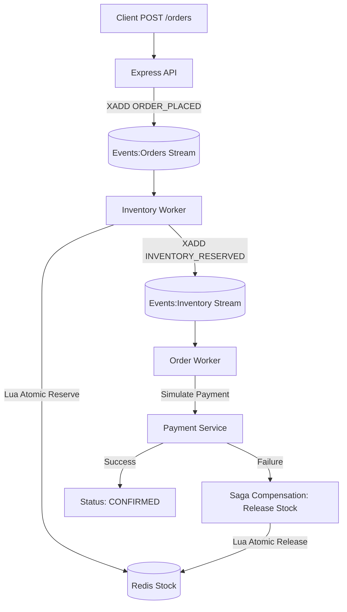

# 🚀 High-Concurrency Inventory & Order Management System


[](https://nodejs.org/)
[](https://expressjs.com/)
[](https://github.com/redis/ioredis)
[](https://redis.io/)
[](https://opensource.org/licenses/MIT)

An enterprise-grade, event-driven inventory system optimized for **high-concurrency flash sales**. Built with **Node.js** and **Redis Streams**, it solves the core challenge of e-commerce: maintaining exact stock counts under extreme simultaneous demand without overselling or performance degradation.

---

## 🔥 Key Features

- **⚡ Zero Overselling**: Uses atomic Lua scripts executed inside Redis to guarantee that stock is only decremented if available, even under millisecond-level concurrency.
- **🔄 Saga Pattern Implementation**: Automatically handles "compensating transactions." If a downstream step (like payment) fails, reserved stock is instantly released back to the pool.
- **📈 Real-Time Dashboard**: A live operations hub tracking order funnels (Placed → Reserved → Confirmed/Rejected) and stock levels with 2s refresh cycles.
- **📦 Scalable Workers**: Decoupled architecture where Inventory and Order workers can be scaled horizontally to handle millions of events.
- **🛡️ Fault Tolerance**: Built on Redis Streams (not just Pub/Sub), ensuring events are persisted and processed exactly once, even if workers restart.

---

## 🏗️ System Architecture

The system uses a pipeline of asynchronous stages, each decoupled by Redis Streams:



---

## 📊 Performance Benchmarks

This system is tested against real-world "flash sale" scenarios.

### 1. Flash Sale Stress Test
**Scenario**: 200 simultaneous users trying to buy 50 available units.

| Metric | Result |
| :--- | :--- |
| **Concurrent Requests** | 200 |
| **Available Stock** | 50 |
| **Successful Orders** | **50 (Exact Match)** |
| **Overselling** | **❌ 0 Units** |
| **Success Rate** | 100% Correctness |

### 2. Throughput & Reliability
**Scenario**: 500 orders processed end-to-end with a 10% payment failure rate.

| Metric | Result |
| :--- | :--- |
| **Processing Time** | ~23 Seconds |
| **Confirmed Orders** | 431 |
| **Saga Rollbacks** | 36 (Automatically Restored) |
| **Average Throughput** | ~20 Orders/Sec (Single Threaded) |

---

## 🛠️ Getting Started

### Prerequisites
- [Node.js](https://nodejs.org/) (v16+)
- [Redis](https://redis.io/) (v6.2+ for Streams support)

### Installation
1. **Clone the repo**:
   ```bash
   git clone https://github.com/yogita-mehta/inventory-management-system.git
   cd inventory-management-system
   ```
2. **Install dependencies**:
   ```bash
   npm install
   ```
3. **Configure environment**:
   ```bash
   cp .env.example .env
   ```
4. **Seed the database**:
   ```bash
   npm run seed
   ```

### Running the System
Run each command in a separate terminal:
```bash
npm run start:api                # REST API on :4100
npm run start:inventory-worker   # Handles stock reservation
npm run start:order-worker       # Handles payment processing
npm run start:dashboard          # Web Dashboard on :5100
```

---

## 📂 Project Structure

| Path | Description |
| :--- | :--- |
| `src/api/` | Express REST endpoints for placing orders. |
| `src/inventory/` | Lua scripts and store logic for atomic operations. |
| `src/workers/` | Consumer groups for processing event streams. |
| `src/events/` | Wrapper for Redis Streams communication. |
| `src/dashboard/` | Real-time monitoring frontend. |
| `scripts/` | Testing and seeding utilities. |

---

## 📝 Future Roadmap

- [ ] **Rate Limiting**: Add leaky-bucket rate limiting to the API.
- [ ] **Sharding**: Support Redis Cluster for multi-node stock partitioning.
- [ ] **Webhooks**: Real-time push notifications for order status changes.
- [ ] **Auto-Recovery**: Implement `XPENDING` logic for abandoned events.

---

## ⚖️ License
Distributed under the MIT License. See `LICENSE` for more information.

---
Built with ❤️ for High-Performance E-commerce.
